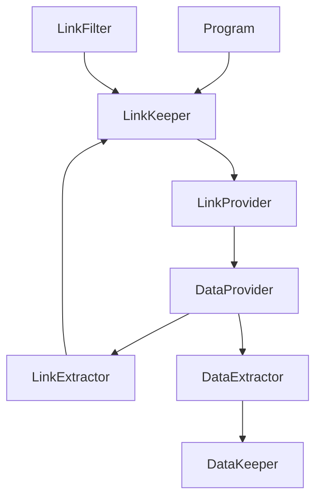

# Snippy

Snippy is a web scraping and data extraction tool that allows you to collect structured data from web pages. It follows a modular architecture and provides a flexible way to define data extraction schemas.

## Features

- Web page content fetching
- Link extraction and filtering
- Structured data extraction based on CSS selectors
- Modular and extensible architecture
- Asynchronous data processing

## Architecture

The project follows a modular architecture with the following main components:

1. **DataProvider**: Fetches HTML content from URLs
2. **LinkProvider**: Manages and provides URLs for processing
3. **LinkExtractor**: Extracts new links from HTML content
4. **LinkFilter**: Filters links based on domain rules
5. **LinkKeeper**: Stores and manages discovered links
6. **DataExtractor**: Extracts structured data from HTML based on schema
7. **DataKeeper**: Stores extracted data

## Component Interaction Flow

## Data Flow

1. Initial URLs are added to LinkKeeper
2. LinkProvider retrieves URLs from LinkKeeper
3. DataProvider fetches HTML content from URLs
4. LinkExtractor processes HTML to find new links
5. New links are filtered and added to LinkKeeper
6. DataExtractor processes HTML to extract structured data
7. Extracted data is stored in DataKeeper

## Usage

1. Define your data extraction schema
2. Initialize the components
3. Add initial URLs to LinkKeeper
4. Run the data collection process
5. Access collected data from DataKeeper

## Requirements

- .NET Core
- HtmlAgilityPack

## License

This project is licensed under the terms specified in the LICENSE file.